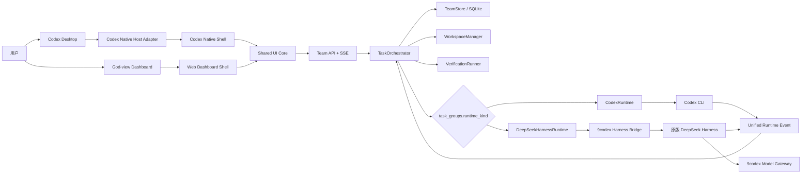

# 9codex Codex 原生融合与双 Runtime 开发计划

状态：本地实现与自动化验收完成；Codex Desktop 人工视觉及远程安装待验收
版本：0.3
日期：2026-08-17
仓库：`/Users/cc/9codex`
基线：`main@26502be`，`@hooliy/9codex 2.0.3`
当前 Codex Desktop：`26.803.61601 (6396)`

## 1. 结论

本计划将 9codex 建设为统一的 AI 软件团队控制平面，同时提供：

1. 与当前 Codex Desktop 原生界面无感融合的 `Codex Native Surface Injection`。
2. Codex 内嵌界面与独立 God-view Dashboard 共用的 `Shared UI Core`。
3. 项目级二选一的 `CodexRuntime` 与 `DeepSeekHarnessRuntime`。
4. Runtime 无关的任务编排、持久化、事件、审计、验收和恢复。

保留现有持久任务内核。重写 Codex 私有 UI 接入、执行 Runtime 边界、任务 API 与前端。DeepSeek Harness 保持原版，全部定制位于 9codex 仓库和 Harness 树外插件。

本计划不维护旧架构兼容层，不支持多个 Codex Renderer 或多个 DeepSeek Harness 版本。目标版本发生破坏时，重写对应 Host Adapter 或 Harness Bridge。

### 1.1 当前落地状态

截至 2026-08-17：

- 通用 `demand-intake` Skill 读取用户明确授权的消息、文本或文档来源，统一生成 Demand Proposal；周计划不是核心领域模型。
- Proposal 未确认前不创建执行任务；确认后的 Requirement Revision 成为唯一执行事实，保留来源、复述、确认和修订审计。
- 项目经理根据需求确认、完成、失败、恢复等事件持续拆分和重排任务。
- Task Group 可选择 `codex` 或 `deepseek-harness` Runtime；活动执行期间由 Store 原子拒绝切换。
- Codex Task Center 已接入原生右侧栏 Tab，支持关闭、显式恢复、键盘焦点、Escape 关闭详情和 Codex/Harness 同构审计卡片。
- 独立 Taskboard 共用 TeamStore 事实源，支持 Runtime 概览、空闲项目切换和 Requirement 完整审计时间线。
- 本地全量自动化测试 `372/372` 通过；核心模块语法检查和 `git diff --check` 通过。
- 发布候选包 `/private/tmp/9codex-release-candidate.D456VL/hooliy-9codex-2.0.3.tgz` 已完成隔离安装验证；SHA-256 为 `9c3177235ae0fb339476eebe0325c41f9fe614a058dc48827d7dc606b12e3a52`。
- 代码合同与生成脚本已验收；真实 Codex Desktop 人工视觉、实际键盘遍历、明暗主题和截图验收未完成。
- 2026-08-17 复检 `100.100.2.83:22` 超时，Tailscale 显示目标机离线；远程安装、双 Runtime 实机闭环、24 小时稳定性和回滚演练均未完成。

---

## 2. 审计基线

### 2.1 已执行验证

计划起点全量测试为 `297/297`。本轮实现后重新执行：

```text
npm test

tests:     372
passed:    372
failed:    0
duration:  263.6s
```

审计时工作区已有以下未提交修改，本计划不得覆盖：

```text
lib/model-state.mjs
lib/models.mjs
lib/protocol.mjs
test/activation.test.mjs
test/catalog.test.mjs
test/control-plane.test.mjs
test/gateway.test.mjs
test/model-state-lifecycle.test.mjs
test/models.test.mjs
test/protocol.test.mjs
```

### 2.2 可保留的现有能力

| 能力 | 当前实现 |
|---|---|
| 持久任务事实源 | `lib/team-store.mjs`，SQLite、WAL、外键、事务 |
| 需求生命周期 | DemandEvent、Requirement、RequirementRevision |
| 执行图 | WorkItem DAG、依赖、优先级 |
| 并行安全 | 最大 20 Worker、write/read set、资源锁、租约 |
| Workspace 隔离 | `lib/workspace-manager.mjs`，Git worktree |
| 监督恢复 | 心跳、Checkpoint、失败重试、重启恢复 |
| 独立验收 | Worker、Reviewer、Integrator、Evidence、Acceptance |
| 审计投递 | Event、Outbox、原子状态与事件提交 |
| 模型接入 | 本地 Responses 网关、Chat 转换、模型能力目录 |
| 本地安全 | loopback、独立 Bearer Token、私有文件权限 |

### 2.3 必须解除的现有强绑定

#### Codex 执行绑定

```text
lib/codex-adapter.mjs
lib/task-orchestrator.mjs
lib/team-planner.mjs
lib/team-runtime.mjs
```

当前执行依赖：

```text
codex exec --json
codex exec resume --json
thread.started
turn.completed
codex_thread_id
```

`TaskOrchestrator` 直接理解 Codex Thread 和 Codex JSONL 事件，无法直接挂接第二 Runtime。

#### Codex Renderer 绑定

```text
lib/task-center-bridge.mjs
lib/platform.mjs
lib/team-runtime.mjs
```

当前注入混合了：

- CDP 连接。
- React Fiber/Props 读取。
- 私有 Selector。
- 原生 Tab 克隆。
- 数据 View Model。
- UI 模板和样式。
- Renderer 操作队列。
- 自动修复和 Codex 重启。

必须整体重写，不能继续叠加 Selector、Fallback 或版本分支。

#### 单文件 Taskboard 绑定

```text
lib/taskboard.mjs
```

当前 Taskboard 同时承担 HTTP API、认证、HTML、CSS、浏览器逻辑和控制操作；每两秒轮询。它不能作为 Codex Native UI 与独立 Dashboard 的共享基础。

#### 数据模型绑定

```sql
worker_sessions.codex_thread_id
```

该字段把领域数据库绑定到 Codex。必须迁移为 Runtime 中立字段。

---

## 3. 目标

### 3.1 产品目标

1. 用户在 Codex 中提出需求。
2. 需求分析师生成复述、验收条件和初步任务拆分。
3. 用户确认前不执行开发任务。
4. 用户按项目选择 `Codex` 或 `DeepSeek Harness` 执行内核。
5. 项目经理监督 DAG、并发、依赖、冲突、失败和返工。
6. Worker、Reviewer、Integrator 使用同一项目 Runtime。
7. Codex 内原生融合界面显示当前项目、Agent、阻断和控制操作。
8. 独立 Dashboard 提供完整 God-view、Diff、日志、证据和审计。
9. 两个客户端显示同一个事实源，不复制业务逻辑。
10. Runtime 故障、服务重启、Codex 重启后可恢复项目状态。
11. 项目完成后可验收、归档和回收执行资源。

### 3.2 架构目标



### 3.3 完成标准

满足以下全部条件才可发布：

- 同一需求分别使用 `codex`、`deepseek-harness` 完成完整闭环。
- 项目 Runtime 选择持久化、可审计、重启后不变化。
- 存在活动 Run 时，所有 Runtime 切换入口均原子拒绝。
- 两个 Runtime 产生相同统一事件语义。
- Codex Native UI 与当前 Codex 视觉、布局、焦点、主题和 Header/Panel 行为一致。
- Codex Native UI 与 Dashboard 共用 UI Core、Team API 和 SSE。
- Codex Native UI 不使用 Shadow DOM、iframe、悬浮入口。
- 不修改 Codex 安装包。
- 不修改 DeepSeek Harness 源码或 `node_modules`。
- SQLite v1 数据迁移到新 Schema 后记录完整保留。
- 本地自动化测试通过。
- `100.100.2.83` 完成安装、双 Runtime、原生 UI 和回滚演练验收。

---

## 4. 非目标

第一版明确不做：

1. 不用 MCP App UI 承载主控制台。
2. 不修改 Codex Desktop 安装包、asar、签名或内部数据库 Schema。
3. 不维护多个 Codex Desktop Renderer 版本。
4. 不提供旧 Selector、备用 Selector、Fiber Fallback、DOM Fallback。
5. 不维护多个 DeepSeek Harness 版本。
6. 不修改、Fork、猴子补丁或内存替换 DeepSeek Harness。
7. 不支持同一项目混用不同 Runtime 角色。
8. 不支持单个 WorkItem 覆盖项目 Runtime。
9. 不支持活动 Run 原地热切换 Runtime。
10. 不尝试把 Codex Thread 的内部上下文转换成 Harness Session，反之亦然。
11. 不提供 Runtime 插件市场、动态 Provider Registry 或通用 Runtime SDK。
12. 不提供公网、多租户、组织权限和远程协作认证。
13. 不承诺模型缺失 Tool Calling、结构化输出或取消能力时仍可执行开发任务。
14. 不把 Harness 原始内部对象直接作为 9codex 领域模型。
15. 不保留旧单文件 Taskboard 页面作为第二套业务前端。

---

## 5. 强制设计原则

### 5.1 事实源

```text
TeamStore 是唯一项目事实源。
Runtime Session 不是项目事实源。
UI 内存状态不是项目事实源。
Agent 自报完成不是验收事实。
```

### 5.2 单版本实现

Codex Native Host 与 DeepSeek Harness Bridge 各只有一个当前实现：

```text
支持当前已验证版本
契约失败
立即禁用受影响入口
重写当前实现
```

禁止：

```text
codex-v1/codex-v2
harness-rc4/harness-rc5
legacy/current
compatibilityMode
selectorCandidates
tryOldProtocol
```

### 5.3 双 Runtime 不是兼容层

`CodexRuntime` 和 `DeepSeekHarnessRuntime` 是两个明确产品模式。两者共同实现一个最小执行契约，不暴露各自内部事件给 `TaskOrchestrator`。

### 5.4 项目内 Runtime 一致

同一 TaskGroup 的 Planner、Worker、Reviewer、Integrator 全部使用：

```text
task_groups.runtime_kind
```

不允许角色级、WorkItem 级、Run 级选择器。

### 5.5 失败关闭

无法确认 Runtime、Renderer、事件序列、目标项目或执行归属时：

- 不启动 Run。
- 不执行切换。
- 不伪造恢复。
- 不静默降级。
- 记录阻断事件并显示明确原因。

---

## 6. Codex Native Surface Injection

### 6.1 目标

注入后必须表现为 Codex 当前版本的原生功能，而不是嵌入应用。

当前 `26.803.61601 (6396)` Renderer 不存在右侧 Tab Strip。旧
`data-app-shell-tabs` / `data-app-shell-tab-strip-controller` 契约作废并整体重写；
不得为不存在的旧表面保留兼容分支。

目标表面：

| Codex 表面 | 9codex 内容 |
|---|---|
| 原生 Header 操作区 | 克隆当前原生按钮得到 `任务中心` 入口和状态 |
| 原生主内容 Panel | 当前项目、需求确认、Agent 状态、阻断、快捷控制 |
| 原生中央 Workspace | `任务中心` 激活时替换当前会话内容，关闭后完整恢复 |
| 原生任务/会话入口 | Codex Worker 跳转、项目状态标记 |
| 原生通知表达 | 完成、失败、阻断、待验收状态 |

### 6.2 明确禁止

- Shadow DOM。
- iframe。
- `position: fixed` 悬浮启动按钮。
- 独立视觉品牌。
- 自建与 Codex 不一致的弹窗、Toast、Tab、Tooltip。
- 修改 Codex React Store、Context、模型配置或执行状态。
- 把 9codex 业务状态写入 Codex 私有 Store。
- 每秒扫描多个备用 DOM 结构。

### 6.3 Host Adapter 边界

所有 Codex 私有 UI 依赖只能存在于：

```text
ui/codex-native/host/
```

当前实现接口：

```js
mount()
activate()
deactivate()
openCodexThread(threadId)
dispose()
```

其他模块禁止：

- 查询 Codex 私有 Selector。
- 访问 `__reactFiber*`。
- 访问 `__reactProps*`。
- 在 Host 外操作 Codex 原生 Header、Panel 或会话行。
- 读取 Codex 私有路由。

### 6.4 当前版本契约

启动时一次性验证当前 Renderer 契约：

- 主 Renderer 唯一。
- 当前应用版本等于 `26.803.61601 (6396)`。
- `main[data-app-shell-main-surface="default"]` 唯一存在。
- `header[data-app-shell-application-menu-bar="false"]` 唯一存在。
- `[data-app-shell-main-content-layout="thread-edge-scroll"]` 唯一存在。
- 当前 Header 可见的原生右侧操作按钮可唯一解析并克隆。
- 当前主题 Token 可读取。
- `[data-app-action-sidebar-thread-row][role="button"]` 可唯一读取
  `data-app-action-sidebar-thread-id="local:<thread-id>"` 并使用原生 `click()` 导航。

任一失败：

1. 不注入部分 UI。
2. 写入 `codex_native.contract_failed` 审计事件。
3. `9codex status` 返回具体失败项。
4. 独立 Dashboard 保持可用。
5. 重写 Host Adapter；不添加兼容分支。

Dashboard 是独立正式产品入口，不是旧 Renderer 的兼容 UI。

### 6.5 原生视觉

Codex Native Shell 直接挂入 Codex DOM，继承当前：

- 字体和字号。
- 行高和间距。
- Design Token。
- 明暗主题。
- Header 按钮高度、圆角、Hover、Pressed 状态。
- Button、Input、Badge、Tooltip 外观。
- Focus Ring。
- Keyboard Navigation。
- Scrollbar。
- Loading、Empty、Error 状态。
- Reduced Motion。

自定义 CSS 必须位于 `[data-ninecodex-root]` 命名空间内。禁止全局元素选择器覆盖 Codex。

### 6.6 原生行为

必须实现：

- 原生 Button 键盘激活、`aria-controls` 和 `aria-pressed`。
- Panel 打开、关闭和焦点恢复。
- 激活时只隐藏当前主内容 Panel；关闭、卸载、契约变化时恢复。
- 当前项目切换。
- Codex Worker Thread 跳转。
- Harness Agent 打开中央 Run 详情。
- Renderer Reload 后单次恢复。
- 重复注入幂等。
- 注入卸载后恢复原生 DOM。
- 不影响 Codex 原有终端、Diff、任务切换和快捷键。

### 6.7 CDP 安全

- 调试地址固定为 `127.0.0.1`。
- 每次启动分配新端口。
- Session 文件权限 `0600`。
- 校验 Codex PID、Renderer URL 和应用版本。
- 不向 Renderer 注入 Team API Bearer Token。
- Renderer 通过受限 Bridge 调用 Team API。
- 注入脚本不包含模型 API Key、控制平面 Token。
- 9codex 停止时释放 CDP 会话。

---

## 7. Shared UI Core

### 7.1 结构

```text
ui/
├── core/
│   ├── api-client.js
│   ├── event-stream.js
│   ├── project-store.js
│   ├── view-models.js
│   ├── actions.js
│   └── components/
├── codex-native/
│   ├── host/
│   ├── native-shell.js
│   ├── native-theme.css
│   └── entry.js
└── dashboard/
    ├── web-shell.js
    ├── routes.js
    ├── web-theme.css
    └── entry.js
```

### 7.2 共用内容

- Team API Client。
- SSE Client。
- Project Store。
- Requirement Revision View Model。
- Task DAG View Model。
- Agent Tree View Model。
- Run Timeline View Model。
- Evidence、Acceptance、Artifact View Model。
- Runtime 选择和切换规则。
- 暂停、恢复、取消、归档操作。
- 加载、错误、断线和重连状态。
- 业务组件和无障碍语义。

### 7.3 Shell 仅负责

`CodexNativeShell`：

- Codex Host 挂载点。
- 原生导航。
- 原生主题映射。
- Codex Thread 跳转。
- 中央 Workspace 生命周期。

`WebDashboardShell`：

- 浏览器路由。
- 独立页面布局。
- 本地 Dashboard Session。
- 浏览器打开文件和下载 Artifact。

禁止在两个 Shell 中复制：

- 状态机。
- API 请求规则。
- Runtime 规则。
- 需求确认逻辑。
- 项目控制逻辑。
- 事件归并逻辑。

### 7.4 实时更新

采用：

```text
HTTP Command + SSE Query Stream
```

不用 WebSocket。

SSE 要求：

- 使用 `events.id` 作为递增 Cursor。
- 支持 `Last-Event-ID`。
- 重连后补发缺失事件。
- 客户端按 `event_id` 幂等。
- 检测断档后重新获取项目 Snapshot。
- 心跳事件不写入业务状态。
- 所有命令通过普通 HTTP POST。

---

## 8. 双 Runtime

### 8.1 Runtime 标识

唯一合法值：

```text
codex
deepseek-harness
```

代码名称：

```text
CodexRuntime
DeepSeekHarnessRuntime
```

### 8.2 最小 Runtime Contract

```js
createSession(input)
startRun(session, input)
sendInstruction(session, input)
interruptRun(run, reason)
resumeSession(session, input)
closeSession(session, reason)
subscribeEvents(listener)
dispose()
```

返回对象只允许暴露 Runtime 中立字段：

```json
{
  "runtime_kind": "codex",
  "runtime_session_id": "external-session-id",
  "runtime_agent_id": "external-agent-id-or-null",
  "runtime_run_id": "external-run-id-or-null"
}
```

### 8.3 CodexRuntime

来源：

```text
lib/codex-adapter.mjs
```

处理：

- 完全重写并改名为 `lib/codex-runtime.mjs`。
- 保留 argv 启动、环境白名单、无 Shell、超时、中断能力。
- `codex exec --json` 仅存在于该文件。
- Codex JSONL 解析仅存在于该文件。
- `thread.started`、`turn.completed` 等事件仅在该文件转换。
- 不向 Orchestrator 暴露 Codex Worker 对象。
- Codex Thread ID 作为 `runtime_session_id`。
- Codex 原生跳转信息通过 Runtime Metadata 和 Conversation Binding 提供。

### 8.4 DeepSeekHarnessRuntime

新增：

```text
lib/deepseek-harness-runtime.mjs
harness-plugin/
```

约束：

- 锁定一个精确 DeepSeek Harness 版本。
- 使用 Harness 正式树外插件机制。
- 不修改 Harness 仓库、包文件或运行时内存。
- 9codex 与 Harness Bridge 使用 JSON-RPC 2.0 over stdio。
- 子进程使用 argv 启动，不经过 Shell。
- Bridge 输出稳定事件，不暴露 Cordis 私有对象。
- Harness 模型请求通过 9codex Model Gateway。
- Bridge 崩溃时所有所属 Run 标记失联，进入现有恢复流程。

最小 Bridge 方法：

```text
initialize
session/create
run/start
run/instruct
run/interrupt
session/resume
session/close
shutdown
```

Bridge Notification：

```text
runtime/event
runtime/heartbeat
runtime/fatal
```

### 8.5 Runtime 创建

只允许一个显式选择函数：

```js
runtimeKind === "codex" ? codexRuntime : deepSeekHarnessRuntime
```

禁止新增：

```text
RuntimeRegistry
RuntimePluginLoader
RuntimeFactory
RuntimeProviderResolver
RuntimeCompatibilityMatrix
```

### 8.6 Planner、Worker、Reviewer、Integrator

创建项目时确定 Runtime。该项目全部角色使用同一实例类型：

```text
Planner
Worker
Reviewer
Integrator
```

现有 `team-planner.mjs` 不能继续直接依赖 Codex Adapter，必须依赖所选项目 Runtime。

---

## 9. 项目级 runtime_kind

### 9.1 创建规则

`task_group_submit`、Dashboard 和 Codex Native UI 创建需求时必须提供或明确选择：

```json
{
  "runtime_kind": "codex"
}
```

缺省值只来自一个静态产品默认值：

```text
codex
```

不得根据模型、操作系统、失败次数或可执行文件自动猜测 Runtime。

### 9.2 持久化规则

`task_groups.runtime_kind` 是项目当前 Runtime 的唯一事实。

`worker_sessions.runtime_kind` 和 `runs.runtime_kind` 保存创建时快照，用于历史审计。它们不得被项目后续切换批量改写。

### 9.3 允许切换

#### 尚未执行

以下全部成立时可直接切换：

- TaskGroup 状态为 `collecting` 或 `awaiting_confirmation`。
- 不存在 WorkerSession。
- 不存在 Run。

#### 已有执行历史

必须执行受控重启，不是热迁移：

1. 用户明确请求切换。
2. TaskGroup 已暂停。
3. 不存在 `queued` 或 `running` Run。
4. 不存在 `creating`、`running`、`waiting`、`closing` WorkerSession。
5. 保存已验证 Checkpoint。
6. 关闭旧 Runtime Session。
7. 创建新 Requirement Revision 或明确的恢复边界。
8. 原子更新 `task_groups.runtime_kind`。
9. 记录 `task_group.runtime_changed`。
10. 新 Runtime 创建全新 Session，从 Runtime-neutral Handoff/Checkpoint 继续。

不复制旧 Runtime 的内部上下文、Tool 状态或 Pending Approval。

### 9.4 禁止活动 Run 热切换

只要存在：

```sql
runs.status IN ('queued', 'running')
```

Runtime 切换必须返回：

```text
409 runtime_switch_blocked
```

同时满足：

- UI 禁用切换控件并解释原因。
- MCP 工具返回结构化错误。
- TeamStore 事务再次检查，防止竞态。
- 不先修改配置再尝试停止 Run。
- 不自动中断 Run 后继续切换。
- 不部分迁移 Session。

切换检查和 `task_groups.runtime_kind` 更新必须在同一数据库事务内完成。

---

## 10. 统一事件协议

### 10.1 Envelope

```json
{
  "protocol_version": 1,
  "event_id": 12345,
  "event_key": "codex:session-id:source-event-id",
  "event_type": "runtime.run.completed",
  "occurred_at": "2026-08-14T12:00:00.000Z",
  "recorded_at": "2026-08-14T12:00:00.050Z",
  "task_group_id": "tg_...",
  "work_item_id": "wi_...",
  "worker_session_id": "ws_...",
  "run_id": "run_...",
  "runtime_kind": "codex",
  "runtime_session_id": "external-session-id",
  "runtime_agent_id": null,
  "runtime_run_id": "external-run-id",
  "payload": {}
}
```

### 10.2 统一事件类型

第一版只实现：

```text
runtime.session.created
runtime.session.resumed
runtime.session.closing
runtime.session.closed
runtime.agent.created
runtime.agent.status_changed
runtime.run.started
runtime.run.output
runtime.run.interrupted
runtime.run.completed
runtime.run.failed
runtime.tool.started
runtime.tool.output
runtime.tool.completed
runtime.files.changed
runtime.usage.updated
runtime.checkpoint.requested
runtime.heartbeat
runtime.fatal
```

### 10.3 语义要求

- Runtime Adapter 负责原始事件转换。
- Orchestrator 只理解统一事件。
- 每个外部事件必须有稳定 `event_key`。
- `event_key` 唯一，重复事件不重复改变状态。
- `event_id` 由 TeamStore 写入时分配。
- `occurred_at` 来自 Runtime；`recorded_at` 来自 9codex。
- 状态迁移依据 `event_id`，不依据网络到达时间。
- 原始 Payload 必须先脱敏、限长，再写入事件。
- Tool 输入默认只存摘要；秘密字段不得写入。
- `runtime.run.completed` 只表示执行结束，不表示 WorkItem 验收通过。
- WorkItem 关闭仍必须经过 Reviewer、Evidence、Acceptance、Integrator。

### 10.4 Codex 映射

示例：

```text
thread.started  => runtime.session.created
turn.started    => runtime.run.started
item.*          => runtime.run.output / runtime.tool.*
turn.completed  => runtime.run.completed + runtime.usage.updated
process exit != 0 => runtime.run.failed
```

### 10.5 Harness 映射

Harness Agent、Session、Tool、Subagent 事件由 Bridge 转换：

```text
Harness Session   => runtime.session.*
Harness Agent     => runtime.agent.*
Harness Run/Turn  => runtime.run.*
Harness Tool      => runtime.tool.*
Harness Usage     => runtime.usage.updated
Harness Fatal     => runtime.fatal
```

Harness 原始事件名不得进入 Orchestrator、Team API 或 UI。

---

## 11. 数据迁移

### 11.1 Schema 目标

当前 `CURRENT_SCHEMA_VERSION = 1`。目标迁移为 v2。

#### task_groups

新增：

```sql
runtime_kind TEXT NOT NULL DEFAULT 'codex'
CHECK (runtime_kind IN ('codex','deepseek-harness'))
```

#### worker_sessions

删除：

```sql
codex_thread_id
```

新增：

```sql
runtime_kind TEXT NOT NULL
CHECK (runtime_kind IN ('codex','deepseek-harness')),
runtime_session_id TEXT NOT NULL,
runtime_agent_id TEXT,
runtime_metadata TEXT NOT NULL DEFAULT '{}'
```

唯一性：

```sql
UNIQUE(runtime_kind, runtime_session_id)
```

#### runs

新增：

```sql
runtime_kind TEXT NOT NULL
CHECK (runtime_kind IN ('codex','deepseek-harness')),
runtime_run_id TEXT,
runtime_metadata TEXT NOT NULL DEFAULT '{}'
```

#### events

新增：

```sql
event_key TEXT,
runtime_kind TEXT,
runtime_session_id TEXT,
runtime_agent_id TEXT,
runtime_run_id TEXT,
occurred_at TEXT
```

索引：

```sql
CREATE UNIQUE INDEX events_event_key
ON events(event_key)
WHERE event_key IS NOT NULL;
```

### 11.2 v1 数据转换

所有现有 TaskGroup：

```text
runtime_kind = codex
```

所有现有 WorkerSession：

```text
runtime_kind       = codex
runtime_session_id = codex_thread_id
runtime_agent_id   = NULL
runtime_metadata   = {}
```

所有现有 Run：

```text
runtime_kind = 对应 WorkerSession.runtime_kind
runtime_run_id = NULL
runtime_metadata = {}
```

现有 Conversation Binding 保留。Codex Worker Thread 仍可用于原生 UI 跳转，但不再作为 WorkerSession 的领域字段。

### 11.3 表重建

由于必须删除 `worker_sessions.codex_thread_id`，不得只新增字段后保留旧列。v2 Migration 必须在一次排他事务中重建：

```text
worker_sessions
conversation_bindings
runs
checkpoints
work_item_leases
resource_locks
```

流程：

1. WAL Checkpoint。
2. 使用现有迁移机制生成数据库备份。
3. 创建 v2 临时表。
4. 按外键顺序复制、转换并校验行数。
5. 校验所有 Runtime Session ID 非空且唯一。
6. 删除旧依赖表和旧 `worker_sessions`。
7. 重命名 v2 表。
8. 重建索引和 Trigger。
9. 执行 `PRAGMA foreign_key_check`。
10. 执行 `PRAGMA integrity_check`。
11. 写入 `schema_migrations(version=2)`。
12. 提交事务。

迁移失败时使用现有 `TeamStoreMigrationError` 和备份恢复机制恢复 v1。

### 11.4 不保留兼容 API

迁移完成后立即删除：

```text
codexThreadId
codex_thread_id
attachWorkerConversation
worker_thread_id
```

新 API 使用：

```text
runtimeSessionId
runtime_session_id
attachRuntimeSession
runtime_session_id
```

Codex Thread 跳转通过 `conversation_bindings` 或 `runtime_metadata` 明确读取，不为旧字段保留 Alias。

---

## 12. Team API

### 12.1 拆分

将 `lib/taskboard.mjs` 重写为：

```text
lib/team-api.mjs
lib/team-sse.mjs
lib/dashboard-server.mjs
```

API 不返回 HTML。Dashboard Server 只提供构建后的静态资源。

### 12.2 最小端点

```http
GET    /api/projects
POST   /api/projects
GET    /api/projects/:projectId

POST   /api/projects/:projectId/requirements
POST   /api/projects/:projectId/requirements/:eventKey/confirm
POST   /api/projects/:projectId/requirements/:eventKey/reject

POST   /api/projects/:projectId/runtime
POST   /api/projects/:projectId/pause
POST   /api/projects/:projectId/resume
POST   /api/projects/:projectId/cancel
POST   /api/projects/:projectId/archive

GET    /api/projects/:projectId/tasks
GET    /api/tasks/:taskId
GET    /api/tasks/:taskId/runs
GET    /api/tasks/:taskId/events
GET    /api/projects/:projectId/artifacts
GET    /api/projects/:projectId/audit

GET    /api/events/stream
GET    /api/healthz
```

### 12.3 安全

- 固定监听 `127.0.0.1`。
- Bearer Token 不进入 URL Fragment。
- Codex Native Renderer 不直接持有长期 Token。
- 请求体大小限制。
- Artifact 路径必须验证位于 Artifact Root。
- 删除、取消、清空、归档要求明确确认。
- 日志、事件、错误响应脱敏。
- CSP 仅用于独立 Dashboard。
- 第一版不监听局域网，不增加账号系统。

---

## 13. 阶段计划

### Phase 0：冻结契约与验收样本

目标：

- 固定当前支持的 Codex Desktop 版本。
- 固定一个 DeepSeek Harness 精确版本。
- 保存当前 Codex Renderer DOM、Computed Token、键盘行为和截图基线。
- 验证 Harness 树外插件可创建 Session、Agent、Run、Tool，支持中断和事件订阅。

输出：

```text
docs/codex-native-host-contract.md
docs/runtime-event-protocol.md
test/fixtures/codex-renderer/
test/fixtures/harness-events/
```

退出条件：

- Native Host 契约可自动检测。
- Harness PoC 不修改 Harness 源码。
- 两端事件可映射到统一协议。

失败处理：

- Codex 契约不成立：重写 Host 目标，不进入 UI 实现。
- Harness 契约不成立：停止 Harness Runtime 实施，不做内存劫持。

### Phase 1：Runtime-neutral Schema 与事件

目标：

- 完成 v2 Migration。
- 增加项目 `runtime_kind`。
- 删除 `codex_thread_id`。
- 增加统一 Runtime Event。
- Orchestrator 不再解析 Codex 私有事件。

主要文件：

```text
lib/team-store.mjs
lib/task-orchestrator.mjs
lib/worker-lifecycle.mjs
lib/revision-lifecycle.mjs
test/team-store.test.mjs
test/task-orchestrator.test.mjs
test/runtime-events.test.mjs
```

退出条件：

- v1 数据完整迁移。
- 迁移失败自动恢复。
- 统一事件重复投递不重复迁移状态。
- 现有 297 项测试经重写后全部通过。

### Phase 2：CodexRuntime

目标：

- 用 `CodexRuntime` 替换 `CodexAdapter`。
- Planner、Worker、Reviewer、Integrator 通过 Runtime Contract 执行。
- Codex 事件全部转换为统一事件。

删除：

```text
lib/codex-adapter.mjs
test/codex-adapter.test.mjs
```

新增：

```text
lib/codex-runtime.mjs
test/codex-runtime.test.mjs
```

修改：

```text
lib/team-planner.mjs
lib/task-orchestrator.mjs
lib/team-runtime.mjs
test/team-planner.test.mjs
test/team-runtime.test.mjs
test/persistent-team-e2e.test.mjs
```

退出条件：

- Codex Runtime 完整闭环与当前行为等价。
- Orchestrator 中不存在 `thread.started`、`turn.completed`、`codex_thread_id`。

### Phase 3：DeepSeekHarnessRuntime

目标：

- 树外 Harness Bridge。
- Runtime Contract 全部实现。
- Harness Event 映射。
- Model Gateway 接入。
- 崩溃、中断、恢复和关闭可控。

新增：

```text
lib/deepseek-harness-runtime.mjs
lib/harness-bridge-client.mjs
harness-plugin/package.json
harness-plugin/index.js
harness-plugin/bridge.js
test/deepseek-harness-runtime.test.mjs
test/harness-bridge-contract.test.mjs
test/fixtures/harness-events/
```

修改：

```text
package.json
lib/team-runtime.mjs
lib/config.mjs
test/config.test.mjs
```

退出条件：

- Harness 源码零修改。
- 精确版本锁定。
- 需求、开发、Reviewer、Integrator 完整闭环。
- Bridge 重启后已持久化项目状态不丢失。

### Phase 4：项目 Runtime 选择与切换约束

目标：

- 创建项目时选择 Runtime。
- 所有角色继承项目 Runtime。
- 活动 Run 热切换被数据库和 API 双重拒绝。
- 非活动项目支持受控切换。

主要文件：

```text
lib/team-store.mjs
lib/task-orchestrator.mjs
lib/mcp.mjs
lib/team-api.mjs
test/runtime-selection.test.mjs
test/mcp.test.mjs
test/team-api.test.mjs
```

退出条件：

- 并发切换与 Run 启动竞争时只有一个事务成功。
- 历史 Session、Run 保留原 Runtime 快照。
- 切换事件完整记录 Actor、Reason、From、To、Checkpoint。

### Phase 5：Team API 与 SSE

目标：

- API 从 Taskboard 页面彻底分离。
- Snapshot 与增量事件稳定。
- 支持断线补发和幂等。

新增：

```text
lib/team-api.mjs
lib/team-sse.mjs
test/team-api.test.mjs
test/team-sse.test.mjs
```

删除：

```text
lib/taskboard.mjs
test/taskboard.test.mjs
```

修改：

```text
lib/team-runtime.mjs
lib/mcp.mjs
test/team-runtime.test.mjs
test/mcp.test.mjs
```

退出条件：

- SSE 重连不丢事件、不重复改变状态。
- API 不包含 HTML。
- Token 不出现在 URL、HTML、事件和日志。

### Phase 6：Shared UI Core 与独立 Dashboard

目标：

- 建立共享状态、组件和动作。
- 完成完整 God-view Dashboard。

新增：

```text
ui/core/
ui/dashboard/
lib/dashboard-server.mjs
test/ui-core.test.mjs
test/dashboard-server.test.mjs
```

Dashboard 页面：

1. 项目列表。
2. 需求与 Revision 时间线。
3. Task DAG。
4. Agent 树。
5. Run、Tool、输出时间线。
6. Diff、测试、Evidence、Acceptance。
7. Artifact。
8. Runtime、模型、Token、成本。
9. 审计和归档。

退出条件：

- 所有操作只经过 Team API。
- 所有实时状态只经过 SSE。
- 浏览器刷新后从事实源恢复。
- 无第二套业务状态机。

### Phase 7：Codex Native Surface Injection

目标：

- 完全重写现有 Task Center Bridge。
- 右侧原生 Tab、Panel、中央 Workspace 无感融合。
- 使用 Shared UI Core。

删除：

```text
lib/task-center-bridge.mjs
test/task-center-bridge.test.mjs
```

新增：

```text
lib/codex-native-bridge.mjs
ui/codex-native/host/
ui/codex-native/native-shell.js
ui/codex-native/native-theme.css
ui/codex-native/entry.js
test/codex-native-host.test.mjs
test/codex-native-visual.test.mjs
```

修改：

```text
lib/platform.mjs
lib/team-runtime.mjs
test/platform.test.mjs
test/team-runtime.test.mjs
```

退出条件：

- 无 Shadow DOM、iframe、悬浮入口。
- 不存在 Selector Fallback 数组。
- 不存在 Renderer 版本分支。
- Tab、Panel、Workspace、主题、焦点和快捷键验收通过。
- 连续运行 24 小时无重复注入、闪烁、布局跳动。

### Phase 8：MCP 控制面

目标：

- MCP 保留正式控制能力，不承担主 UI。
- 工具覆盖需求、Runtime、项目控制、验收和 Dashboard 打开。

工具：

```text
project_create
project_list
project_get
requirement_submit
requirement_confirm
requirement_reject
project_runtime_change
project_pause
project_resume
project_cancel
project_archive
task_get
agent_get
acceptance_get
dashboard_open
```

主要文件：

```text
lib/mcp.mjs
test/mcp.test.mjs
```

退出条件：

- MCP 不包含 UI 业务逻辑。
- 所有工具调用 Team API。
- 错误返回结构化、脱敏。

### Phase 9：安装、升级、回滚与发布

目标：

- 打包新增 UI 和 Harness Plugin。
- 安装时执行 Schema 迁移和契约检查。
- Health 输出 Runtime、Native Host、SSE、数据库状态。
- 自动更新失败可恢复旧版本和旧数据库。

主要文件：

```text
package.json
bin/9codex.mjs
lib/activation.mjs
lib/service.mjs
lib/updater.mjs
README.md
test/activation.test.mjs
test/service.test.mjs
test/updater.test.mjs
test/cli.test.mjs
```

退出条件：

- `npm pack --dry-run` 包含所需 UI 和 Harness Plugin。
- 全新安装通过。
- v1 升级通过。
- 安装失败回滚通过。
- 远程目标机验收通过。

---

## 14. 总文件清单

### 14.1 保留

```text
lib/team-store.mjs
lib/task-orchestrator.mjs
lib/workspace-manager.mjs
lib/verification-runner.mjs
lib/revision-lifecycle.mjs
lib/worker-lifecycle.mjs
lib/token-budget.mjs
lib/gateway.mjs
```

保留表示继续演进，不表示不修改。

### 14.2 删除并重写

```text
lib/codex-adapter.mjs
lib/task-center-bridge.mjs
lib/taskboard.mjs
test/codex-adapter.test.mjs
test/task-center-bridge.test.mjs
test/taskboard.test.mjs
```

### 14.3 新增核心文件

```text
lib/codex-runtime.mjs
lib/deepseek-harness-runtime.mjs
lib/harness-bridge-client.mjs
lib/team-api.mjs
lib/team-sse.mjs
lib/dashboard-server.mjs
lib/codex-native-bridge.mjs
harness-plugin/
ui/core/
ui/codex-native/
ui/dashboard/
```

### 14.4 禁止新增

```text
lib/runtime-registry.mjs
lib/runtime-plugin-loader.mjs
lib/runtime-compatibility.mjs
lib/codex-version-adapters/
lib/harness-version-adapters/
legacy/
fallback/
```

---

## 15. 测试计划

### 15.1 单元测试

#### Runtime Contract

- 两个 Runtime 对同一 Contract 测试集。
- Session 创建、恢复、关闭。
- Run 启动、中断、失败、完成。
- 重复事件。
- 乱序事件。
- 非零退出。
- 超时。
- Bridge 崩溃。
- 秘密脱敏。

#### Runtime 选择

- 新项目缺省 `codex`。
- 显式 `deepseek-harness`。
- 非法值拒绝。
- 所有角色继承项目 Runtime。
- 活动 Run 切换返回 409。
- 并发启动 Run 与切换只允许一个成功。
- 历史 Run Runtime 不被改写。

#### TeamStore Migration

- 空 v1 数据库升级。
- 完整 v1 生命周期数据升级。
- `codex_thread_id` 正确映射。
- 外键、唯一索引、Trigger 重建。
- 迁移中断恢复。
- 备份完整性。
- 新版本打开旧 DB。
- 旧版本拒绝新 DB。

#### Unified Events

- Codex/Harness 映射一致。
- `event_key` 幂等。
- Event 与 Outbox 原子。
- SSE Cursor 连续。
- Payload 限长和脱敏。
- Runtime completed 不绕过验收。

#### Shared UI Core

- Snapshot Hydration。
- 增量事件归并。
- SSE 断线补发。
- Runtime 切换按钮状态。
- DAG、Agent、Run View Model。
- 错误、空状态、加载状态。

#### Native Host

- 当前 Renderer Fixture 契约。
- Tab 挂载、切换、关闭。
- Panel/Workspace 挂载。
- 主题变化。
- Focus 恢复。
- Keyboard Navigation。
- 幂等注入。
- Dispose 恢复。
- 契约失败时零部分注入。

### 15.2 集成测试

#### CodexRuntime E2E

```text
需求
确认
规划
并行 Worker
Reviewer
Evidence
Integrator
完成
```

#### DeepSeekHarnessRuntime E2E

执行同一验收脚本，输出相同 9codex 领域状态和统一事件类型。

#### 恢复

- 9codex 服务重启。
- Codex CLI 进程退出。
- Harness Bridge 退出。
- Provider 限流。
- Agent 失联。
- SSE 断线。
- Migration 中断。

### 15.3 UI 验收

#### 视觉

- 字体、字号、行高一致。
- Header 入口高度、圆角、间距一致。
- Hover、Active、Focus 一致。
- Light/Dark Theme 一致。
- 图标尺寸和线宽一致。
- Scrollbar、Loading、Error 一致。
- 无 iframe 边界感。
- 无独立浮层感。

#### 行为

- 原生 Header Button 键盘激活。
- 原生主内容 Panel 展开和关闭。
- 中央 Workspace 切换。
- Codex Worker 正确跳转。
- Harness Run 正确打开。
- Renderer Reload 自动恢复一次。
- 无重复入口或 Panel。
- 无闪烁。
- 不影响 Codex 原生功能。

视觉测试保存当前版本基线截图。Codex 更新导致差异时，测试失败并要求重写 Host Adapter；不得更新多个版本基线。

### 15.4 安全测试

- CDP 仅 loopback。
- Team API 仅 loopback。
- 无 Token URL。
- 无 Token Renderer Storage。
- Artifact 路径穿越拒绝。
- 日志和事件秘密脱敏。
- Harness Bridge argv 无 Shell。
- Worker/Verifier 保持现有生产和不可逆命令限制。
- 删除、取消、归档要求确认。

### 15.5 必跑命令

```bash
npm test
npm pack --dry-run
```

新增专项命令应保持最少：

```bash
node --test test/codex-runtime.test.mjs
node --test test/deepseek-harness-runtime.test.mjs
node --test test/runtime-selection.test.mjs
node --test test/team-store.test.mjs
node --test test/team-api.test.mjs test/team-sse.test.mjs
node --test test/codex-native-host.test.mjs test/codex-native-visual.test.mjs
```

---

## 16. 远程安装测试验收

目标：

```text
主机：100.100.2.83
用户：hooliy
日期：实施完成后
```

密码不得写入仓库、文档命令、环境文件、Shell History、日志或测试产物。优先使用临时 SSH Key；否则由 SSH 交互式密码提示输入。禁止使用 `sshpass`。

### 16.1 前置条件

- 用户明确授权远程安装窗口。
- 目标机有图形登录会话。
- Codex Desktop 已安装并可登录。
- Node.js 满足 `>=24`。
- Git 可用。
- 目标 Workspace 是测试仓库，不是生产仓库。
- 目标机现有 `~/.9codex` 已备份。
- 目标机现有 9codex 版本和 Codex 版本已记录。

### 16.2 远程预检

```bash
ssh hooliy@100.100.2.83
uname -a
sw_vers
node --version
npm --version
git --version
command -v 9codex || true
9codex version || true
9codex status || true
```

如果目标机不是本计划已验收的当前 macOS/Codex 组合，停止安装。重写目标平台实现，不增加跨版本或跨 Renderer Fallback。

### 16.3 备份

远程停止 9codex 后备份：

```text
~/.9codex/config.json
~/.9codex/team.sqlite
~/.9codex/team.sqlite-wal
~/.9codex/team.sqlite-shm
~/.9codex/artifacts/
~/.9codex/backups/
~/.9codex/desktop-session.json
当前 npm 全局 9codex 版本
当前 LaunchAgent
```

备份目录：

```text
~/.9codex-acceptance-backup-20260814/
```

权限：

```text
目录 0700
文件 0600
```

### 16.4 构建与传输

本机：

```bash
cd /Users/cc/9codex
npm test
npm pack --dry-run
npm pack
scp hooliy-9codex-*.tgz hooliy@100.100.2.83:~/
```

传输前后计算 SHA-256，必须一致。

### 16.5 安装

远程：

```bash
npm install --global ~/hooliy-9codex-*.tgz
9codex version
9codex install
9codex restart
9codex status
```

安装必须：

- 自动备份并迁移 TeamStore。
- 不覆盖现有上游凭据。
- 不修改 Codex 应用包。
- 不修改 DeepSeek Harness 源码。
- 注册并启动当前用户 LaunchAgent。
- Health 返回数据库、API、SSE、两个 Runtime 和 Native Host 状态。

### 16.6 CodexRuntime 验收

新建独立测试项目：

```text
runtime_kind = codex
```

需求：

```text
在临时 Git 仓库新增一个最小 HTTP health endpoint，并添加无框架自检。
```

验收：

- 需求复述后等待确认。
- 确认后生成 DAG。
- Codex Worker Session 可见。
- Native UI 可跳转对应 Codex Thread。
- Reviewer 与 Integrator 独立运行。
- 测试证据持久化。
- WorkItem 和 TaskGroup 完成。
- Dashboard 与 Native UI 状态一致。

### 16.7 DeepSeekHarnessRuntime 验收

新建另一独立测试项目：

```text
runtime_kind = deepseek-harness
```

使用相同需求和验收标准。

验收：

- Harness Bridge 正常启动。
- 原版 Harness 包校验未变化。
- Agent/Session/Tool 事件进入统一协议。
- Harness Agent 可在 Native UI 与 Dashboard 中查看。
- 模型请求经过 9codex Gateway。
- Reviewer 与 Integrator 完整闭环。
- 中断、恢复、关闭无孤儿进程。

### 16.8 禁止热切换验收

1. 启动一个长时间 Codex Run。
2. 请求切换到 `deepseek-harness`。
3. 必须返回 `409 runtime_switch_blocked`。
4. 原 Run 不得被自动中断。
5. `task_groups.runtime_kind` 不得变化。
6. 暂停项目并等待所有 Run 结束。
7. 保存 Checkpoint。
8. 执行受控切换。
9. 新 Runtime 创建新 Session。
10. 历史 Codex Run 仍标记 `codex`。

Harness 到 Codex 方向重复同一测试。

### 16.9 Native UI 验收

- `任务中心` 位于当前 Codex Header 原生操作区。
- 入口由当前可见原生 Header 按钮克隆，外观与相邻按钮一致。
- 当前版本不存在 Tab Strip；不得注入自建 Tab Strip 或保留旧契约。
- 无悬浮按钮。
- 无 Shadow DOM。
- 无 iframe。
- Light/Dark 切换一致。
- 键盘激活、Focus、关闭、恢复一致。
- 中央 God-view 与 Codex Workspace 无双滚动。
- Renderer Reload 后恢复且不重复。
- Codex 原有 Terminal、Diff、任务导航正常。
- 连续运行 24 小时无重复节点、内存持续增长或事件重复。

### 16.10 故障验收

- 强制结束 Codex Worker。
- 强制结束 Harness Bridge。
- 重启 9codex 服务。
- 断开 SSE 后恢复。
- 制造重复 Runtime Event。
- 制造迁移失败副本。
- 制造 Provider 429。
- 制造相同验证连续失败。

所有场景必须：

- 状态可解释。
- 审计完整。
- 无错误完成状态。
- 无孤儿锁、租约、worktree 或子进程。

### 16.11 验收证据

保存到本地受控目录，不提交 Git：

```text
远程版本和系统信息
npm test 输出
npm pack 清单
安装输出
9codex status
数据库 Schema 与 integrity_check
CodexRuntime 项目 Snapshot
HarnessRuntime 项目 Snapshot
统一事件样本
禁止热切换响应
Native UI Light/Dark 截图
Dashboard 截图
24 小时稳定性统计
回滚输出
```

所有证据先脱敏。

---

## 17. 风险

| 风险 | 等级 | 处理 |
|---|---:|---|
| Codex 私有 Renderer 结构变化 | 高 | 单版本契约；失败关闭；重写 Host Adapter |
| 完美原生融合必须使用私有 UI 结构 | 高 | 耦合仅限 `ui/codex-native/host/` |
| React Reconciliation 删除注入节点 | 高 | 使用明确 Host 生命周期和卸载；契约测试；不修改 Codex Store |
| CDP 暴露页面控制能力 | 高 | 随机 loopback 端口、PID/URL 校验、私有 Session 文件 |
| Harness Developer Preview API 变化 | 高 | 精确锁定版本；Bridge Contract Test；破坏时重写 |
| 自定义模型 Tool Calling 不完整 | 高 | Capability Preflight；Fail Fast；不静默降级 |
| 双 Runtime 事件语义漂移 | 高 | 同一 Contract Suite 和统一事件 Fixture |
| 活动 Run 切换导致状态损坏 | 高 | 数据库事务硬拒绝；不自动中断 |
| v2 表重建丢失状态 | 高 | 迁移前备份、行数校验、外键检查、失败自动恢复 |
| UI 与事实源不一致 | 中 | Snapshot + SSE Cursor；SQLite 唯一事实源 |
| Runtime 事件重复或乱序 | 中 | `event_key` 幂等、TeamStore `event_id` 排序 |
| Harness/Codex 孤儿进程 | 中 | Runtime `dispose`、Session Close、恢复扫描 |
| Token 进入 Renderer 或日志 | 高 | 服务端 Bridge、脱敏测试、URL 禁止 Token |
| 双前端逻辑分叉 | 中 | Shared UI Core；Shell 不含业务状态机 |
| 远程目标环境不匹配 | 高 | 预检失败即停止；不增加兼容模式 |

---

## 18. 回滚

### 18.1 回滚触发条件

任一情况触发：

- Schema Migration 失败。
- `npm test` 失败。
- Health 失败。
- Codex Native Host 契约失败。
- Codex 原生功能受影响。
- CodexRuntime 闭环失败。
- HarnessRuntime 闭环失败。
- Runtime 热切换保护失败。
- 数据、事件或审计不一致。
- 发现 Token 泄漏。

### 18.2 安装阶段自动回滚

安装激活前保存：

- 当前 npm 包版本。
- 当前 CLI 路径。
- 当前配置。
- 当前 TeamStore 备份。
- 当前 LaunchAgent。
- 当前 Codex 配置备份。

新版本 Health 失败：

1. 停止新服务。
2. 恢复旧 npm 包。
3. 恢复旧配置。
4. 恢复 v1 TeamStore 备份。
5. 恢复旧 LaunchAgent。
6. 恢复 Codex 配置。
7. 重启旧服务。
8. 验证旧版本 Health。

### 18.3 数据库回滚

Schema v2 不能由旧代码安全读取。回滚到旧代码必须同时恢复迁移前 v1 数据库。

步骤：

1. 停止 9codex。
2. 保存当前 v2 DB、WAL、SHM 作为故障证据。
3. 删除活动 v2 DB、WAL、SHM。
4. 复制迁移前 v1 备份为活动 DB。
5. 权限设为 `0600`。
6. 启动旧版本。
7. 执行 `integrity_check` 和旧版本测试。

迁移后新产生的数据不会自动降级到 v1。正式切换窗口内禁止创建生产项目，直到升级验收完成。

### 18.4 Native UI 回滚

- 停止注入 Bridge。
- 调用 Host Adapter `dispose()`。
- 移除唯一 9codex Root、Tab、Panel、Workspace。
- 恢复被隐藏的原生节点。
- 重启 Codex。
- 独立 Dashboard 保留。

不恢复旧 `task-center-bridge.mjs`。出现问题时重写新 Host Adapter。

### 18.5 Harness 回滚

- 停止接受新的 Harness 项目。
- 暂停已有 Harness 项目。
- 中断并关闭所有 Harness Run/Session。
- 关闭 Bridge。
- 保留项目数据库、Checkpoint 和审计。
- 用户明确选择后，通过受控 Runtime 切换重新执行。

不回退到 Harness 源码修改、内存劫持或旧协议。

### 18.6 远程机回滚验收

在 `100.100.2.83` 必须实际执行一次：

- 安装候选版本。
- 完成 v2 迁移。
- 停止候选版本。
- 恢复旧包和 v1 DB。
- 验证旧版本运行。
- 再安装候选版本并重新迁移。

回滚演练失败则不得发布。

---

## 19. 实施顺序与依赖

```text
Phase 0 契约冻结
  ↓
Phase 1 Schema + Unified Events
  ↓
Phase 2 CodexRuntime
  ↓
Phase 3 DeepSeekHarnessRuntime
  ↓
Phase 4 Runtime 选择/切换
  ↓
Phase 5 Team API + SSE
  ↓
Phase 6 Shared UI Core + Dashboard
  ↓
Phase 7 Codex Native Surface
  ↓
Phase 8 MCP
  ↓
Phase 9 安装、远程验收、发布
```

不得先重写 UI 再定义 Runtime Event；否则 UI 会再次绑定 Codex 私有事件。

不得先增加 Harness Runtime 再迁移数据；否则领域模型会同时出现 `codex_thread_id` 与 Harness 专用字段。

不得在 Codex Native Host 契约未固定前扩展多个原生表面。

---

## 20. 里程碑

### M1：Runtime-neutral 内核

- Schema v2。
- Unified Runtime Event。
- CodexRuntime 完整闭环。
- 现有能力无回归。

### M2：双 Runtime

- DeepSeekHarnessRuntime 完整闭环。
- 项目级 Runtime。
- 热切换保护。
- 双 Runtime Contract Suite。

### M3：统一控制面

- Team API。
- SSE。
- Shared UI Core。
- 独立 Dashboard。

### M4：Codex 原生融合

- Header 原生任务中心入口。
- 原生主内容 Panel。
- 中央 Workspace。
- 当前版本视觉和行为验收。

### M5：远程发布候选

- 本地全测。
- 安装包。
- `100.100.2.83` 双 Runtime 验收。
- 24 小时稳定性。
- 回滚演练。

---

## 21. 最终发布门禁

以下命令全部成功：

```bash
npm test
npm pack --dry-run
```

以下人工验收全部签字：

- Codex Native UI 视觉无感。
- Codex 原生行为未受损。
- CodexRuntime 项目完成。
- DeepSeekHarnessRuntime 项目完成。
- 活动 Run 热切换被拒绝。
- 非活动项目受控切换完成。
- Dashboard 与 Native UI 一致。
- Migration 和回滚演练完成。
- 远程 24 小时运行无阻断缺陷。
- 无凭据泄漏。

任一项失败：不发布，不增加兼容补丁；定位边界后重写对应模块。
